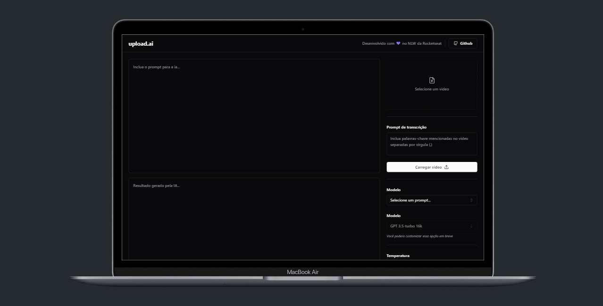

# Upload AI - FrontEnd

<div align="center">
  
</div>

## 1 - Sobre

Aplicação que possibilita realizar upload de videos e por meio de IA, criar automaticamente títulos chamativos e descrições com um boa indexação.

---

## 2 - Tecnologias

Um pouco das tecnologias que foram utilizadas no projeto até agora: 

- ReactJS
- TypeScript
- Tailwind CSS
- Radix UI
- Axios

---

## 3 - Instalação e uso

### Requisitos:
- [NodeJS](https://nodejs.org/en/)
- [Npm](https://www.npmjs.com) ou [yarn](https://yarnpkg.com)

Clone o projeto em sua máquina e instale as dependências com o comando:

```shell
yarn
ou
npm install
```

---

A aplicação está rodando em servidor local, por tanto, execute a [API](https://github.com/felipems1/upload-ai-backend) localmente para testar a aplicação. Para rodar o servidor BackEnd basta seguir as instruções deixada no readme da API mencionada.

---

Com todas as dependencias devidamente instaladas, basta rodar o seguinte comando:

```shell
yarn dev
ou
npm run dev
```